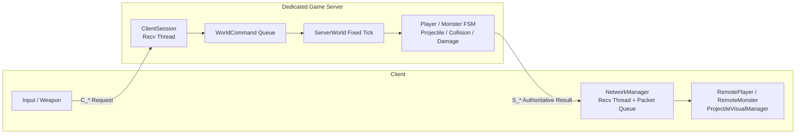

# MyEngineW-DirectX11

<p align="center">
  <b>DirectX 11 기반 3D 게임 엔진과 서버 권위형 멀티플레이 전투 프로토타입</b>
</p>

<p align="center">
  
  
  
  
  
</p>

## 프로젝트 소개

`MyEngineW-DirectX11`은 Win32와 DirectX 11을 기반으로 렌더링, 컴포넌트, 애니메이션, 충돌, UI, 리소스 관리 시스템을 직접 구현하고, 그 위에 **서버 권위형 멀티플레이 전투 구조**까지 확장한 개인 프로젝트입니다.

단순히 화면에 오브젝트를 출력하는 데서 끝내지 않고 다음 흐름을 하나의 프로젝트 안에서 연결하는 것을 목표로 했습니다.

- DirectX 11 기반 3D 렌더링 파이프라인
- GameObject / Component 기반 엔진 구조
- 스켈레탈 애니메이션과 본 소켓 무기 장착
- JSON 기반 FSM 몬스터 AI
- TCP 패킷 송수신과 스트림 프레이밍
- 고정 Tick 기반 서버 월드
- 서버 권위형 투사체, 근접 공격, 충돌 및 데미지 판정
- 원격 플레이어·몬스터·총알의 클라이언트 표현 동기화

---

## 프로젝트 개요

| 구분 | 내용 |
|---|---|
| 개발 형태 | 개인 프로젝트 |
| 클라이언트 | Win32, DirectX 11, HLSL |
| 게임 서버 | WinSock2 TCP 기반 콘솔 서버 |
| 언어 | C++17 / C++20, HLSL |
| 개발 환경 | Windows 10/11, Visual Studio 2022, x64 |
| 주요 외부 구성 | DirectXMath, Assimp, FBX SDK, FMOD |
| 핵심 주제 | 엔진 아키텍처, 네트워크 게임플레이, 서버 권위형 시뮬레이션 |

---

## 핵심 구현 요약

| 영역 | 구현 내용 |
|---|---|
| Rendering | D3D11 Device/Context/SwapChain, 정적·스키닝 모델 렌더링, Constant Buffer, HLSL 셰이더 |
| Material | Albedo / Normal Texture, Directional Diffuse + Ambient Lighting |
| Architecture | Scene / Layer / GameObject / Component 기반 객체 구조 |
| Animation | Skeleton, Bone Mapping, Animator3D, normalized-time Animation Event |
| Gameplay | 플레이어 이동, 총·검·건틀릿, 무기 교체, 검 콤보, HP UI |
| AI | JSON 상태 그래프 기반 FSM, Client/Server Context 분리 |
| Collision | Layer Matrix, QuadTree Broad Phase, Collider Enter/Stay/Exit |
| Networking | C_/S_ 패킷 분리, EntityId/ProjectileId, SendAll, TCP 스트림 프레이밍 |
| Game Server | 세션 관리, WorldCommand Queue, 고정 Tick ServerWorld |
| Combat Authority | 서버 투사체 이동, Sweep 충돌, 근접 공격 판정, HP 및 사망 확정 |
| Client Replication | RemotePlayer/RemoteMonster, 애니메이션·이동·무기·총알 시각화 동기화 |

---

## 전체 아키텍처



### 책임 분리

**클라이언트**

- 입력 수집과 행동 요청 전송
- 로컬·원격 캐릭터 렌더링
- 서버가 확정한 위치와 상태 적용
- 애니메이션, 무기, UI, 이펙트 표현
- `ProjectileId`에 대응하는 시각 총알 관리

**서버**

- 플레이어·몬스터·투사체의 실제 월드 상태 보유
- 공격 가능 여부와 쿨타임 검증
- 몬스터 FSM 실행
- 투사체 이동과 충돌 판정
- 근접 공격 타격 시점 판정
- HP, 피격, 사망 상태 확정
- 모든 클라이언트에 결과 복제

---

## 엔진 시스템

### 1. Rendering & Resource

- DirectX 11 Device, DeviceContext, SwapChain 초기화
- Vertex / Index Buffer와 Input Layout 관리
- Static Model / Skinned Model 렌더링
- Transform / Animation / UI Constant Buffer
- Albedo 및 Normal Map 기반 셰이딩
- Mesh, Model, Material, Texture 리소스 캐싱
- Frustum Culling 모듈

### 2. Component Architecture

`GameObject`에 필요한 기능을 Component로 조합하는 구조를 사용했습니다.

```text
GameObject
 ├─ Transform
 ├─ ModelRenderer
 ├─ Animator3D
 ├─ Collider
 ├─ Rigidbody
 └─ Script
```

Scene은 Layer별로 GameObject를 관리하고, 각 시스템은 필요한 Component만 조회하여 처리합니다.

### 3. Animation & Weapon Socket

- FBX 기반 스켈레탈 애니메이션
- 모델별 Bone Name Mapping
- Animator3D의 상태 진입·종료 Behaviour
- normalized time 기반 Animation Event
- 손 Bone에 무기 Transform을 부착하는 Socket 구조
- 검 공격의 HitBox On / Combo Open / HitBox Off 이벤트

### 4. JSON FSM

몬스터 상태와 전이를 JSON으로 구성하고 Factory를 통해 Task와 Decision을 생성합니다.

```text
IDLE → PATROL → TRACE → ATTACK
                     ↘ DAMAGE / DEATH
```

FSM 실행 코어는 `IFSMContext`를 통해 엔진 오브젝트와 서버 월드에 대한 의존성을 분리했습니다.

- Client Context: Transform, Animator3D, Scene 기반 행동
- Server Context: ServerMonster, ServerPlayer, ServerWorld 기반 행동
- 몬스터마다 독립적인 FSM runtime 상태 보유

---

## Collision & Combat

### 클라이언트 충돌

- Layer Collision Matrix로 필요한 레이어 조합만 검사
- QuadTree로 Broad Phase 후보 축소
- Collider별 Narrow Phase 수행
- `OnCollisionEnter / Stay / Exit` 이벤트 전달

### 서버 충돌

서버에는 렌더링용 Collider나 Skeleton을 올리지 않고, 단순화한 **Proxy Collider**를 유지합니다.

- 플레이어·몬스터: AABB Proxy
- 빠른 총알: 이전 위치 → 현재 위치의 Segment Sweep
- 검 공격: 공격 방향과 사거리를 이용한 Capsule 형태의 Sweep 근사
- 몬스터 근접 공격: 애니메이션 타격 시점에 서버 거리·범위 재검증

이를 통해 클라이언트의 렌더 프레임이나 로컬 충돌 결과가 아니라, 서버가 최종 데미지를 결정합니다.

---

## 네트워크 설계

### 패킷 규칙

- `C_*`: 클라이언트가 서버에 보내는 요청
- `S_*`: 서버가 검증하고 확정한 결과
- `EntityId`: 플레이어와 몬스터 식별
- `ProjectileId`: 서버 투사체와 클라이언트 시각 오브젝트 연결

예시:

```text
C_ATTACK
  → ServerWorld AttackCommand
  → S_ATTACK
  → S_PROJECTILE_SPAWN
  → 서버 Sweep 충돌
  → S_PROJECTILE_END
  → S_DAMAGE
```

### TCP 스트림 프레이밍

TCP는 패킷 경계를 보장하지 않으므로 `recv()` 한 번을 패킷 하나로 간주하지 않았습니다.

1. 수신 데이터를 `pendingBuffer` 뒤에 누적
2. `PacketHeader`가 완성될 때까지 대기
3. `header.size`로 패킷 전체 길이 확인
4. 완전한 패킷만 분리
5. 남은 조각은 다음 `recv()`와 결합

또한 `send()`가 일부 바이트만 전송할 수 있는 상황을 고려해 `SendAll()`을 구현했습니다.

### 스레드 구조

```text
Client Recv Thread
  → Packet Queue
  → Main Thread에서 Scene 반영

Server Client Thread
  → Packet Decode
  → WorldCommand Queue
  → ServerWorld 단일 스레드가 월드 상태 수정
```

월드 상태를 하나의 서버 스레드가 소유하도록 하여 플레이어, 몬스터, 투사체에 대한 복잡한 다중 mutex 사용을 줄였습니다.

---

## 서버 권위형 전투 흐름

### 총기

1. 클라이언트가 총구 위치와 조준 방향을 `C_ATTACK`으로 전송
2. 서버가 현재 무기, 쿨타임, 총구 위치를 검증
3. 서버가 `ServerProjectile` 생성
4. 모든 클라이언트가 `S_PROJECTILE_SPAWN`으로 시각 총알 생성
5. 서버 Tick에서 투사체 이동과 Segment Sweep 수행
6. 충돌 시 서버가 HP를 차감하고 `S_PROJECTILE_END`, `S_DAMAGE` 전송

### 검

1. 클라이언트가 공격 index와 방향 전송
2. 서버가 콤보별 duration, hit normalized time, reach, radius 설정
3. 타격 시점에 한 번만 Sweep 충돌 검사
4. 서버가 대상 HP와 상태 확정
5. 클라이언트는 `S_DAMAGE` 결과로 UI와 피격 애니메이션 갱신

### 몬스터

1. 서버 FSM이 타겟 탐색, 추적, 공격 상태 결정
2. 서버가 이동·상태·공격 이벤트 복제
3. 공격 애니메이션의 타격 시점에 서버 근접 판정
4. 클라이언트 `RemoteMonsterScript`는 서버 결과만 표현

---

## 주요 문제 해결

### 1. TCP 패킷 합쳐짐·분할 문제

**문제**  
연속 전송된 패킷이 한 번의 `recv()`에 합쳐지거나, 하나의 패킷이 여러 번의 `recv()`로 나뉘어 구조체 캐스팅이 깨지는 문제가 발생했습니다.

**해결**  
누적 버퍼와 `PacketHeader::size`를 이용한 스트림 프레이밍을 서버와 클라이언트 양쪽에 적용했습니다.

### 2. 렌더링 총알과 서버 판정 총알의 분리

**문제**  
모든 클라이언트가 Rigidbody와 Collider로 독립적인 데미지 판정을 하면 결과가 달라질 수 있었습니다.

**해결**  
서버는 순수 데이터형 `ServerProjectile`을 관리하고, 클라이언트는 `ProjectileVisualManager`의 공용 Object Pool에서 렌더링용 오브젝트만 생성하도록 분리했습니다.

### 3. 빠른 투사체의 터널링

**문제**  
속도가 빠른 총알은 한 Tick 사이에 Collider를 통과할 수 있었습니다.

**해결**  
현재 위치의 점 충돌이 아닌, 이전 위치에서 현재 위치까지의 Segment Sweep으로 가장 가까운 충돌 대상을 찾았습니다.

### 4. FSM Context 생명주기 오류

**문제**  
서버 Tick의 지역 `ServerMonsterFSMContext` 주소를 FSM Core가 다음 Tick까지 보관해, 소멸한 객체의 가상 함수를 호출하는 Access Violation이 발생했습니다.

**해결**  
Context 포인터를 `Update()` 실행 중에만 유효하게 유지하고, 외부 상태 전환은 `PendingState`에 저장한 뒤 다음 유효한 Context에서 적용하도록 변경했습니다.

---

## 디렉터리 구조

```text
MyEngineW-DirectX11/
├─ MyEngine_Source/          # 공용 엔진 코어와 프로토콜
│  ├─ Rendering / Resource
│  ├─ Scene / GameObject / Component
│  ├─ Animation / Skeleton / FSM
│  ├─ Collision / Physics / UI
│  └─ NetworkManager / Protocol
│
├─ MyEngine_W/               # 클라이언트 게임플레이 코드
│  ├─ Player / Enemy / Weapon Scripts
│  ├─ RemotePlayer / RemoteMonster
│  ├─ ProjectileVisualManager
│  └─ Scenes
│
├─ GameServer/               # 전용 게임 서버
│  ├─ ClientSession / PacketUtility
│  ├─ ServerTypes
│  ├─ ServerMonsterFSMContext
│  └─ ServerWorld
│
├─ Shaders_SOURCE/           # HLSL Shader
├─ Resources/                # Model / Texture / JSON Data
├─ myEngineforStudy/         # Win32 클라이언트 Entry
├─ External/                 # 외부 라이브러리
└─ myEngineforStudyDX.sln
```

---

## 주요 코드

- [공유 네트워크 프로토콜](./MyEngine_Source/Protocol.h)
- [클라이언트 네트워크 매니저](./MyEngine_Source/MENetworkManager.cpp)
- [서버 진입 및 TCP 스트림 프레이밍](./GameServer/main.cpp)
- [서버 권위 월드](./GameServer/ServerWorld.cpp)
- [서버 월드 타입](./GameServer/ServerTypes.h)
- [FSM Core](./MyEngine_Source/FSMBrainCore.cpp)
- [애니메이터](./MyEngine_Source/MEAnimator3D.cpp)
- [충돌 매니저](./MyEngine_Source/MECollisionManager.cpp)
- [클라이언트 투사체 표현](./MyEngine_W/MEProjectileVisualManager.cpp)

---

## 빌드 및 실행

### 요구 환경

- Windows 10/11
- Visual Studio 2022
- Windows SDK / DirectX 11
- x64 빌드 권장

### 빌드

```bash
git clone https://github.com/myWworld/MyEngineW-DirectX11.git
```

1. `myEngineforStudyDX.sln`을 엽니다.
2. `Debug | x64` 구성을 선택합니다.
3. 프로젝트 속성의 `External` Include / Library 경로가 로컬 환경과 맞는지 확인합니다.
4. 솔루션을 다시 빌드합니다.

### 실행

Visual Studio의 **여러 시작 프로젝트**를 다음처럼 설정합니다.

| 프로젝트 | 동작 |
|---|---|
| `GameServer` | 시작 |
| `myEngineforStudy` | 시작 |
| `MyEngine_W` | 없음 |
| `MyEngine_Source` | 없음 |

서버는 기본적으로 `7777` 포트에서 대기합니다. 서버를 먼저 실행한 뒤 클라이언트를 실행하고, 추가 클라이언트 인스턴스를 실행하면 멀티플레이 동기화를 확인할 수 있습니다.

> `MyEngine_W`는 정적 라이브러리이므로 실행 대상으로 지정하지 않습니다.

---

## 현재 범위와 한계

- TCP 기반 Blocking I/O와 클라이언트별 수신 스레드 사용
- 서버 Collider는 렌더링 메시가 아닌 단순화된 Proxy 사용
- Lag Compensation과 Reconciliation은 미적용
- Interest Management / Replication Graph는 미적용
- 프로젝트의 일부 외부 라이브러리 경로는 로컬 환경에 맞게 조정이 필요할 수 있음

이 프로젝트는 상용 네트워크 엔진을 대체하는 것이 아니라, **렌더링 엔진 내부 구조부터 실시간 권위 서버의 데이터 흐름까지 직접 구현하고 검증한 포트폴리오 프로젝트**입니다.

---

## 학습 및 구현 성과

- DirectX 11 렌더링 파이프라인과 리소스 생명주기 이해
- 스켈레탈 애니메이션과 본 기반 게임플레이 기능 구현
- TCP의 스트림 특성과 패킷 프레이밍 이해
- 클라이언트 표현과 서버 권위 로직 분리
- 고정 Tick 월드와 Command Queue 기반 동시성 설계
- 투사체·근접 공격의 서버 충돌 및 데미지 판정
- 댕글링 포인터, 링크 오류, 멀티스레드 수명 문제 디버깅 경험

---

## Summary

`MyEngineW-DirectX11`은 DirectX 11 기반 엔진 기능을 직접 구축한 뒤, 그 위에 멀티플레이 게임플레이를 얹어 **클라이언트 표현, 저수준 TCP 통신, 서버 월드 시뮬레이션, AI, 충돌, 데미지까지 연결한 프로젝트**입니다.

엔진 기능 구현 자체뿐 아니라, 실제 게임 기능이 클라이언트와 서버 사이에서 어떤 책임으로 분리되고 동기화되어야 하는지를 설계하고 검증하는 데 중점을 두었습니다.

---

## Third-Party

프로젝트에 포함된 외부 라이브러리와 에셋의 저작권 및 라이선스는 각 원저작자에게 있습니다.
